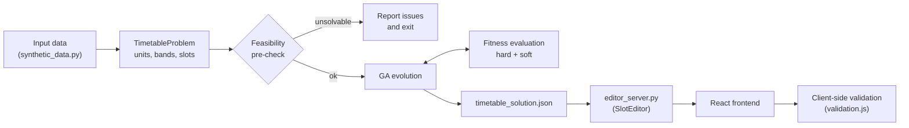
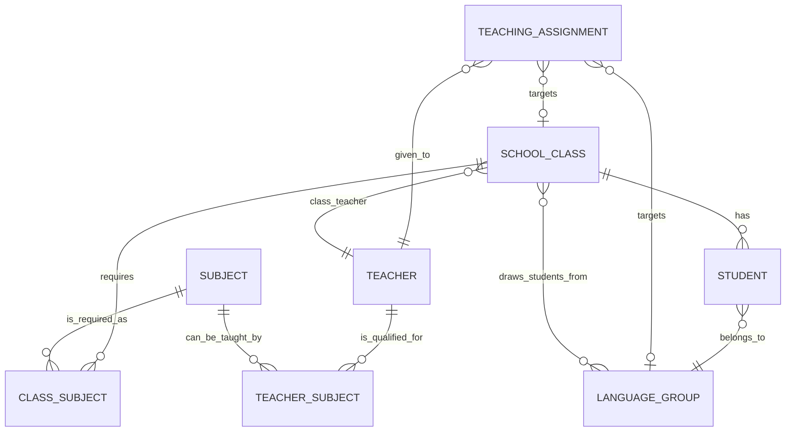

# Advanced Multi-Class Timetable Generator

A weekly school timetable generator for multiple classes and teachers, built on a **Genetic Algorithm (GA)**. It comes with an editing service that suggests and ranks alternative slots for a lesson, and a React interface for viewing, validating and editing the generated timetable.

---

## Table of Contents

1. [Project Overview](#project-overview)
2. [Key Features](#key-features)
3. [How the System Works](#how-the-system-works)
4. [Project Architecture](#project-architecture)
5. [Genetic Algorithm](#genetic-algorithm)
6. [Constraints](#constraints)
7. [Timetable Editing](#timetable-editing)
8. [Frontend](#frontend)
9. [Data](#data)
10. [Installation and Setup](#installation-and-setup)
11. [Usage](#usage)
12. [Validation and Fairness](#validation-and-fairness)
13. [Current Version / Limitations](#current-version--limitations)
14. [Future Improvements](#future-improvements)
15. [License](#license)
16. [Author / Project Information](#author--project-information)

---

## Project Overview

This project builds a complete weekly timetable for a Higher Secondary (+2) school: **5 working days × 7 periods**, with a lunch break between P4 and P5. Lunch is not a teaching period.

School timetabling is a constrained combinatorial search problem. Every class must receive its required weekly periods, no teacher can be in two places at once, teachers are only available at certain times, and some subjects run in parallel across several classes. An exhaustive search is not practical at this size. The project uses a **Genetic Algorithm** instead: it evolves a population of full timetables and scores each one with a fitness function. That function treats **hard constraints** (rules that must never be broken) as heavy penalties and **soft constraints** (quality preferences) as a 0–100 score.

This version (V1) handles **many classes and many teachers at once**. One chromosome is the timetable for every class together, so class and teacher clashes are resolved across the whole school. It also schedules the shared **second-language groups**, where students from several classes are taught different languages by different teachers at the same time.

After generation, a teacher's lesson can be moved to a better slot. The system checks every alternative against the same constraint and fitness code the GA used, ranks the valid ones by their impact on overall quality, and applies a change only when you ask for it.

---

## Key Features

| Area | Feature |
|---|---|
| **Generation** | Multi-class timetable generation: 10 classes and 23 teachers in the default dataset |
| | Genetic Algorithm optimisation with greedy initialisation, class-wise crossover, mutation and local-search repair |
| | Separate hard and soft constraints, reported independently |
| | Teacher availability: teachers are never placed in slots they have marked unavailable |
| | Subject periods per week: each class receives the exact weekly periods for each subject |
| | Period priority: heavier subjects are steered toward more desirable periods |
| | Class-teacher first-period preference (soft) |
| | Parallel second-language bands scheduled as a single unit |
| **Viewing** | Class timetable view |
| | All-classes view, showing every class timetable on one page |
| | Teacher timetable view with daily load totals |
| **Validation** | Clash detection (class, teacher, availability), recomputed in the browser from the timetable itself |
| | Subject period-count validation for each class |
| **Editing** | Teacher timetable editing, one lesson at a time |
| | Best alternative slot suggestions, checked against every hard constraint |
| | Move (into a free period) and swap (with another lesson of the same class) |
| | Ranking by fairness and overall impact, using the GA's own soft-score weights |
| | Preview before applying. Changes that break a hard constraint are refused on the server |
| | Version history: every applied edit is saved as a version, and you can switch to any version at any time |

---

## How the System Works

### Overall flow



1. **Input data.** `synthetic_data.py` produces a relational dataset: classes, teachers, subjects, requirements, language groups and teaching assignments.
2. **Problem model.** `timetable_problem.py` turns the dataset into index-based structures. Each teaching assignment becomes a **unit**. Language groups that share a class are merged into one **band**.
3. **Feasibility pre-check.** Before evolving, the problem is checked for conditions no timetable could satisfy, such as over-assigned teachers or too few shared free slots. If any are found, the generator reports them and exits.
4. **GA.** A population of timetables is evolved using selection, crossover, mutation and repair.
5. **Fitness evaluation.** Every candidate is scored as `soft score − 500 × hard violations`.
6. **Timetable.** The best individual is printed class by class and teacher by teacher, then written to `timetable_solution.json`.
7. **Validation.** The GA prints a validation report. The frontend separately re-derives clashes and period counts from the timetable it is about to draw.

### Hard vs soft constraints

- **Hard constraints** decide whether a timetable is usable at all. Each violation costs **500** fitness points, which is more than the entire soft range (0–100). The search therefore removes clashes before it optimises quality.
- **Soft constraints** measure quality. There are five weighted components that add up to a **0–100 soft score**. A low soft score never makes a timetable invalid.

### How alternatives are ranked during editing

For a selected lesson, each of the other 34 slots in the week is tried as a **move** or a **swap**. Each candidate timetable is scored with the same `evaluate()` function the GA uses. Candidates that add any hard violation are rejected. The remaining candidates are sorted by **fitness delta**, which is their change in overall quality compared with the current timetable. Details are in [Timetable Editing](#timetable-editing).

---

## Project Architecture

```
timetable/
├── synthetic_data.py         # Synthetic dataset generator and dataset validator
├── synthetic_dataset.json    # Dataset written by synthetic_data.py (default config)
├── timetable_problem.py      # Dataset → index-based problem: units, bands, slots, feasibility checks
├── ga_v1.py                  # Genetic algorithm: fitness, operators, evolution, reports, JSON export (CLI)
├── slot_editor.py            # Alternative-slot engine: move/swap candidates, scoring, preview, apply (CLI)
├── version_history.py        # Append-only, in-memory history of timetable versions
├── editor_server.py          # Standard-library HTTP API around SlotEditor + VersionHistory
├── timetable_solution.json   # Current timetable, written by the GA and by every applied edit
└── frontend/                 # React + Vite user interface
    ├── index.html
    ├── package.json
    ├── vite.config.js        # Dev server; proxies /api to the editor service
    ├── dist/                 # Production build output
    └── src/
        ├── main.jsx
        ├── App.jsx           # Views, selectors, edit session, version switching
        ├── validation.js     # Client-side hard-constraint and period-count checks
        ├── styles.css
        ├── api/
        │   ├── editorApi.js      # Client for editor_server.py
        │   └── solutionApi.js    # Loads and normalises the timetable (live or bundled)
        ├── components/
        │   ├── ClassTimetable.jsx       # One class's weekly grid
        │   ├── TeacherSchedule.jsx      # One teacher's grid + in-grid edit mode and ranking colours
        │   ├── EditDialog.jsx           # Full ranked table of alternatives
        │   ├── ClashStatus.jsx          # Hard-constraint status + soft score
        │   ├── SubjectRequirements.jsx  # Required vs scheduled periods per subject
        │   └── VersionList.jsx          # Version history sidebar
        └── data/
            └── timetableSolution.json   # Bundled read-only fallback copy of the timetable
```

| Layer | Files | Responsibility |
|---|---|---|
| **Data** | `synthetic_data.py`, `synthetic_dataset.json` | Generates a reproducible, internally consistent dataset (fixed seed) and validates its references, counts and workloads. |
| **Problem model** | `timetable_problem.py` | The only module that knows the dataset's shape. It builds units and bands, pre-computes teacher availability and allowed slots, and runs the feasibility checks. |
| **GA** | `ga_v1.py` | Fitness function, greedy initialisation, selection, crossover, mutation, repair, the evolution loop, console reports and JSON export. |
| **Editing engine** | `slot_editor.py`, `version_history.py` | Rebuilds the chromosome from the saved solution, generates and scores alternatives, applies changes and records versions. |
| **Backend service** | `editor_server.py` | Small JSON HTTP API, using the Python standard library only. It holds one editor in memory. |
| **Frontend** | `frontend/` | React 19 single-page app built with Vite 7. |

> **Legacy files.** `frontend/src/api/timetableApi.js`, `frontend/src/data/mockTimetables.js`, `frontend/src/components/FitnessScore.jsx`, `frontend/src/components/TimetableGrid.jsx` and `frontend/.env.example` come from an earlier single-class prototype. The current app does not import them.

### Backend API (`editor_server.py`)

| Method | Endpoint | Body | Purpose |
|---|---|---|---|
| `GET` | `/api/health` | none | Service status, class/teacher counts, current hard/soft totals, version info |
| `GET` | `/api/solution` | none | Current timetable, by class and by teacher |
| `GET` | `/api/versions` | none | All versions and the current version id |
| `POST` | `/api/candidates` | `{teacher_id, day, period, unit_id?, limit?}` | Ranked alternatives for the teacher's lesson in that slot |
| `POST` | `/api/preview` | `{change}` | Scores a change without applying it |
| `POST` | `/api/apply` | `{change}` | Applies a change, records a version and saves `timetable_solution.json` |
| `POST` | `/api/versions/restore` | `{version_id}` | Makes an existing version current |

Errors are returned as `{"error": "..."}` with `400` (bad or missing input), `404` (unknown endpoint or no lesson in that slot) or `409` (change refused, for example because it would break a hard constraint or refers to a lesson that has since moved).

---

## Genetic Algorithm

Implemented in [`ga_v1.py`](ga_v1.py).

### Chromosome representation

A chromosome is a list parallel to `problem.units`. Entry `i` holds the **slot indexes** of unit `i`, with one slot per weekly period the unit needs.

- Slots are numbered `0..34` in day-major order: `day = slot // 7` and `period = slot % 7`.
- A **unit** is either a **class lesson** (one class, one teacher, one subject) or a **language band** (several language groups taught in parallel by several teachers, covering several classes).
- One chromosome is therefore a complete timetable for **every class at once**.

```python
# genes[unit_index] -> list of slot indexes
genes[12] = [0, 9, 16, 23, 31]   # e.g. a 5-period English lesson unit
```

### Population

Random chromosomes are not useful here because every class is almost full. Each individual is instead built **greedily**:

1. **Bands first.** They block the same slots in every member class. The builder prefers one band period per day.
2. **Then each class, slot by slot.** It picks a lesson whose teacher is available and free, and prefers a subject not yet taught that day.

This starts the search close to feasible. The population size is 60 by default.

### Fitness calculation

```
fitness = soft_total − HARD_PENALTY × hard_total        (HARD_PENALTY = 500)
```

Hard violations are counted per constraint type. Each soft component is normalised to `0..1` and multiplied by its weight. The weights add up to 100, so the soft score reads as a percentage.

### Selection

**Tournament selection** with a tournament size of 4: sample four individuals at random and keep the fittest.

### Crossover

**Class-wise crossover**, applied at a rate of 0.85. Each class inherits all of its lessons from one parent, chosen with probability 0.5. Bands are global, so they are taken from the first parent as a block. A class that was clash-free in its parent stays clash-free in the child. When crossover is skipped, the child is a copy of the first parent.

### Mutation

A child is mutated with probability 0.35. A mutation applies 2 random moves, each chosen 50/50:

- **`swap_within_class`**: swaps the slots of two lessons of the same class, so the class stays exactly as full as before.
- **`move_lesson`**: moves one lesson of a class unit to another slot where its teacher is available.

### Repair (local search)

Every child gets up to **6 repair passes** before scoring. Each pass picks one lesson involved in a class clash, teacher clash or availability violation and tries these fixes in order:

1. Move it to a slot that is completely free for its class and teachers.
2. Swap it with another lesson of the same class, where both teachers end up on free slots.
3. **Cross-class swap**: move it into an empty slot of its class by displacing the single lesson that blocks its teacher there.
4. **Relaxed swap**: accept a same-class swap only if it strictly reduces the problems around the two slots involved.

### Elitism

The top **3** individuals of each generation are copied unchanged into the next generation.

### Termination

Evolution stops at the first of these conditions:

- **no hard violations** and a soft score of at least **88.0** (`target_soft_score`)
- **150** generations without improvement (`stagnation_limit`)
- **400** generations (maximum)

### Hard/soft constraint handling

- Hard and soft results are always computed and reported **separately** (`Evaluation.hard`, `Evaluation.soft`).
- Because of the 500-point penalty, any timetable with fewer hard violations beats any timetable with more, whatever their soft scores.
- Constraints that no schedule could fix, such as teacher eligibility, workload over the maximum, or a band that cannot cover its classes, are caught by `feasibility_issues()` **before** evolution starts.

### Default parameters

| Parameter | Value | CLI override |
|---|---|---|
| `seed` | 7 | `--seed` |
| `population_size` | 60 | `--population` |
| `generations` | 400 | `--generations` |
| `elite_count` | 3 | none |
| `tournament_size` | 4 | none |
| `crossover_rate` | 0.85 | none |
| `mutation_rate` | 0.35 | none |
| `mutation_moves` | 2 | none |
| `repair_passes` | 6 | none |
| `target_soft_score` | 88.0 | `--target-soft` |
| `stagnation_limit` | 150 | none |

---

## Constraints

### Hard constraints

These are counted by `evaluate()` in `ga_v1.py`. Each one must be **zero** in a valid timetable.

| Key | Meaning | Purpose |
|---|---|---|
| `class_clash` | A class is booked for more than one lesson in the same slot | A class can only attend one lesson at a time |
| `teacher_clash` | A teacher is booked more than once in the same slot | A teacher can only be in one place at a time |
| `required_periods` | A unit has more or fewer slots than its weekly periods | Every subject gets exactly its weekly requirement |
| `duplicate_period` | The same unit is placed twice in one slot | Prevents one lesson being counted twice |
| `teacher_eligibility` | A teacher is assigned a subject outside their skill set | Only qualified teachers teach a subject. Checked against the teacher–subject skill matrix |
| `teacher_availability` | A teacher is scheduled in a slot where they are unavailable | Respects each teacher's availability |
| `language_band` | A class's second-language periods do not match its band slots | Parallel language groups must run in the same slots for every class they draw students from |

**Language bands.** Language groups that share a class are linked into one band. The link is built with union-find over shared classes, and the band is scheduled as a single unit. This makes parallel language-group scheduling valid **by construction**.

**Feasibility pre-checks** in `TimetableProblem.feasibility_issues()` run before evolution. They are not fitness terms:

- The teacher's assigned load is at most `max_weekly_periods`.
- The teacher's assigned load is at most their number of available slots.
- A class does not need more periods than the week has.
- Each class's reserved second-language periods equal the periods its bands supply.
- A band does not need the same teacher in two groups at once, and does not mix group lengths.
- Each unit has at least as many shared free teacher slots as periods.
- "Dead slots" (slots none of a class's teachers can cover) can be covered by its band.

### Soft constraints

Each component is scored `0.00` (worst) to `1.00` (best) and weighted:

| Key | Weight | What it measures |
|---|---:|---|
| `period_priority` | 30 | Heavier subjects (more weekly periods) placed in higher-priority periods, normalised between the best and worst possible pairing |
| `subject_distribution` | 25 | Penalises the same subject appearing more than once in a class's day, and runs of the same subject longer than 2 consecutive periods |
| `gaps_and_blocks` | 20 | Penalises idle gaps between a teacher's first and last lesson of the day |
| `teacher_workload` | 15 | How evenly each teacher's load is spread across the five days (the **fairness** measure) |
| `class_teacher_first_period` | 10 | How often the class teacher takes P1, relative to how many mornings they realistically could. This is a preference only, never a rule |

Period priorities (higher is more desirable):

| P1 | P2 | P3 | P4 | *Lunch* | P5 | P6 | P7 |
|:-:|:-:|:-:|:-:|:-:|:-:|:-:|:-:|
| 7 | 9 | 9 | 8 | none | 6 | 8 | 5 |

> Despite its name, `gaps_and_blocks` currently measures teacher idle gaps only. Over-long subject blocks are penalised under `subject_distribution`.

---

## Timetable Editing

Implemented in [`slot_editor.py`](slot_editor.py) and exposed through [`editor_server.py`](editor_server.py).

### Editing a specific period

1. In **Teacher View**, pick a teacher and press **Edit** on one of their lessons.
2. The frontend calls `POST /api/candidates` with the teacher, day and period.
3. The server finds the lesson (the *placement*) and returns every valid alternative, ranked. The UI requests up to 50, so every legal option can be shaded on the grid.

### Finding and ranking valid alternatives

The editor uses the GA's own rules. There is no separate rule system.

- Each of the other 34 slots is turned into a candidate change:
  - **Move**: the target slot is free for every class the lesson involves.
  - **Swap**: the target slot holds exactly one other **class lesson** of the same class, and the two lessons trade slots.
  - Anything else is not offered and is counted as *rejected*: the slot holds several lessons, it holds a language band, or the lesson being edited is itself a band and the slot is occupied.
- Each candidate is applied to a copy of the chromosome and scored with `ga_v1.evaluate()`.
- A candidate is **valid** only if it adds **no** hard violation of any type.
- Valid candidates are sorted by **`fitness_delta`**, their change in overall fitness, which includes all five weighted soft components. The best-ranked option improves the timetable most or costs it least.
- Each candidate reports its soft-score delta, the per-component deltas (including `teacher_workload`, the fairness component), the resulting soft score and a plain-language summary.

### Move and swap behaviour

| Type | What happens |
|---|---|
| **Move** | The lesson goes to a free period of its class. Nothing else is displaced. |
| **Swap** | The lesson takes the target slot, and the lesson that was there moves to the vacated slot. Both lessons stay within the same class, so the class remains exactly as full as before. |

In the default dataset every class uses all 35 slots, so class lessons can only be **swapped**. Moves become possible when a class has free periods.

### Preview, apply and safety

- **Preview** (`/api/preview`) scores a change without applying it.
- **Apply** (`/api/apply`) re-checks the change on the server. It is refused with `409` if it would break a hard constraint, or if either lesson has moved since the candidates were fetched. Applies are serialised by a lock.
- A successful apply updates the in-memory timetable, records a version, rewrites `timetable_solution.json` and returns the new solution, so every view refreshes.

### Version history

`version_history.py` keeps an **append-only** list of timetable states:

- Version `v0` is the timetable the service loaded at startup. Each applied edit adds a new version.
- Restoring a version moves the *current* marker and deletes nothing, so you can go back and forward freely.
- Editing while an older version is current appends a new version at the end.

---

## Frontend

A React 19 + Vite 7 single-page app, in `frontend/`.

| Element | Description |
|---|---|
| **View toggle** | **Class View** and **Teacher View** buttons in the header. |
| **Class selector** | Dropdown listing every class, plus **All Classes**. Selecting one class also shows its **Subject Requirements** table. |
| **All Classes view** | Renders every class timetable one after another on a single page. |
| **Teacher View** | Dropdown of teachers, sorted by name and labelled with their department. It shows the teacher's week, periods taught against their weekly maximum, a **Day total** column with a load bar and the number of classes/groups taught that day, and a week total. |
| **Timetable layout** | Days are rows and P1–P7 are columns, so each day stays on one line. Narrow screens scroll the table sideways. Class cells show subject and teacher. Second-language cells list each parallel group's language and teacher. |
| **Lunch break** | A narrow **LUNCH BREAK** column between P4 and P5, positioned from `lunch_after_period`. It is never counted as a period. |
| **Validation indicators** | A status panel at the top shows **✓ No Clashes Detected** or the number of hard-constraint violations by type, with an expandable list. Conflicting cells are highlighted and have a **⚠ conflict** button that explains the clash. The soft score is shown separately as a quality measure. |
| **Subject Requirements** | For a single class: required vs scheduled periods per subject, marked **✓ Complete**, **Short by N** or **Over by N**. |
| **Versions sidebar** | Always visible. Lists versions newest first, with time, label, soft score and any violations. Clicking a version switches to it. |
| **Live vs read-only** | If `editor_server.py` is reachable, the app loads the live timetable and enables editing. Otherwise it shows the bundled `src/data/timetableSolution.json` read-only, with a notice explaining how to enable editing. |

### Edit mode and ranking colours

When you press **Edit** on a lesson in Teacher View:

- Every valid alternative slot is shaded directly on the grid. The original cell is tagged *"moving from here"*.
- Each shaded cell shows what it would displace (the swap partner's subject and class, or **Free period**). It has an **ⓘ** button that opens a detail panel, and a quick **Swap** or **Move** button that applies the change directly.
- The detail panel shows the option's rank and tier, move or swap, the lesson and its partner, the overall impact, the fairness impact, **Preview** and **Apply Change**.
- A toolbar shows the lesson being moved, a best-to-worst legend, an **All options (N)** button that opens a table comparing every candidate (slot, type, hard check, overall impact, fairness, what happens), and **Cancel**.

Options are grouped into five **tiers** based on each option's `fitness_delta` relative to the best and worst options on offer. Equally good options therefore get the same colour:

| Tier | Colour |
|---|---|
| Best | Deep green `#193921` |
| Good | Green `#408435` |
| Fair | Olive `#7C8840` |
| Poor | Amber-brown `#88602D` |
| Worst | Red-brown `#883B2D` |

The **Fairness** figure shown for an option is the weighted change in the `teacher_workload` component (`Δ × 15`).

---

## Data

The system currently runs on **synthetic data** from [`synthetic_data.py`](synthetic_data.py). The data models a Kerala Higher Secondary (+2) school for academic year 2025–2026 and is generated from a fixed seed, so it is reproducible.

### Main entities

| Entity | Description |
|---|---|
| **Timetable structure** | Working days, periods, lunch position, period priorities, 35 slots |
| **Subjects** | 18 subjects with type (language / core / elective) and department. Includes a *Second Language* placeholder that reserves periods but is taught through language groups |
| **Classes** | 10 classes across 4 streams (Science CS, Science Biology, Commerce, Humanities), each with a section, student strength and class teacher |
| **Students** | One record per seat (444 in total), each with a second-language choice |
| **Class subjects** | Weekly period requirement for each subject of each class |
| **Teachers** | 23 teachers, each with a department, maximum weekly periods (20–26) and availability (0–3 random unavailable slots) |
| **Teacher subjects** | Skill matrix: each teacher can teach every subject of their department |
| **Language groups** | Students who chose the same second language, pooled across classes |
| **Teaching assignments** | Teacher + target (class or language group) + subject + weekly periods |

### Relationships



### Weekly requirement per stream

Every stream fills all 35 weekly slots:

| Stream | Subjects (periods / week) |
|---|---|
| Science (Computer Science) | English 5, Second Language 4, Physics 6, Chemistry 6, Mathematics 7, Computer Science 7 |
| Science (Biology) | English 5, Second Language 4, Physics 6, Chemistry 6, Biology 7, Mathematics 7 |
| Commerce | English 5, Second Language 4, Business Studies 7, Accountancy 7, Economics 6, Computer Application 6 |
| Humanities | English 5, Second Language 4, History 7, Political Science 7, Economics 6, Sociology 6 |

Second-language options are Malayalam, Hindi, Sanskrit and French.

### Dataset used by the GA

When `ga_v1.py` and `editor_server.py` run without `--dataset`, they generate the dataset in-process with one override: `max_language_group_size = 250`. This produces **one language group per language**, linked into a single band. The resulting problem has 10 classes, 23 teachers, 51 units and 314 lessons to place.

`ga_v1.py --dataset <file>` accepts any JSON file in the same shape. `load_dataset()` is the only function that reads input, so the source can be replaced without changing the GA.

---

## Installation and Setup

### Prerequisites

- **Python 3**. The backend uses the standard library only, so there is nothing to `pip install`. Development used Python 3.13.
- **Node.js** `^20.19.0` or `>=22.12.0`, as required by Vite 7, plus npm.

### 1. Clone the repository

```bash
git clone https://github.com/S1DHARTHK/Advance-Multiclass-TimeTable-Generator.git
```

```bash
cd Advance-Multiclass-TimeTable-Generator
```

### 2. Generate a timetable (optional)

The repository already contains `timetable_solution.json`. To regenerate it:

```bash
python ga_v1.py
```

Useful options:

```bash
python ga_v1.py --generations 600 --population 80 --seed 7 --target-soft 88 --output timetable_solution.json
```

`--no-teacher-view` skips printing the teacher-wise timetables. Exit codes: `0` means no hard violations, `1` means hard violations remain, and `2` means the dataset is infeasible.

### 3. Start the backend (editor service)

```bash
python editor_server.py
```

The service listens on `http://127.0.0.1:8000` by default. Use `--port` and `--host`, or the `PORT` environment variable, to change it. It loads `timetable_solution.json` at startup.

### 4. Start the frontend

```bash
cd frontend
```

```bash
npm install
```

```bash
npm run dev
```

Vite serves the app on `http://localhost:5173`, or on the port in `PORT` if set, and opens a browser. It proxies `/api` to `http://127.0.0.1:8000`. Set the `EDITOR_API` environment variable to proxy somewhere else, or set `VITE_EDITOR_API` to have the browser call the service directly. Its value replaces the `/api` prefix, for example `http://127.0.0.1:8000/api`.

Other frontend scripts:

```bash
npm run build
```

```bash
npm run preview
```

### Optional tools

Regenerate and validate the synthetic dataset file (writes `synthetic_dataset.json`):

```bash
python synthetic_data.py
```

List ranked alternatives for one lesson from the command line:

```bash
python slot_editor.py --teacher TCH-04 --day Monday --period P1 --limit 5
```

---

## Usage

### Generating and viewing a timetable

1. Run `python ga_v1.py`. The console shows progress every 25 generations, then a **validation report** (every hard constraint with its count and every soft component with its score), then the class-wise and teacher-wise timetables. The result is written to `timetable_solution.json`.
2. Run `python editor_server.py`, then `npm run dev` in `frontend/`.
3. In **Class View**, choose a class from the **Class** dropdown, or **All Classes**, to see every timetable.
4. Check the status panel. **✓ No Clashes Detected** means every class, teacher, availability and weekly-period rule is satisfied.
5. With a single class selected, scroll to **Subject Requirements** to confirm each subject's weekly count.

> After regenerating with `ga_v1.py`, restart `editor_server.py` so it loads the new file.

### Editing a teacher's timetable

1. Switch to **Teacher View** and select a teacher.
2. Press **Edit** on the lesson you want to move.
3. Valid alternatives are shaded on the grid from **Best** (deep green) to **Worst** (red-brown).
4. Press **ⓘ** on a shaded slot to see its details, then **Preview** to see the resulting score without applying anything.
5. Press **Apply Change**, or use the quick **Swap**/**Move** button on the cell. Use **All options** to compare every candidate in one table.
6. The timetable, status panel and version list update immediately. Press **Cancel** to leave edit mode without changing anything.
7. To go back or forward, click any entry in the **Versions** sidebar.

---

## Validation and Fairness

### Clash detection

Validation happens in two places:

- **Backend (`ga_v1.evaluate`)** counts all seven hard-constraint types for every candidate. It drives the GA, the validation report, and the edit engine's accept/reject decisions.
- **Frontend (`validation.js`)** re-derives violations from the timetable it is about to draw, without relying on the counts in the file. A stale or hand-edited file is therefore still reported correctly. It detects:
  - **Class clash**: more than one distinct lesson in one class period.
  - **Teacher clash**: a teacher booked for more than one lesson in one period. Band lessons are attributed to the teacher's own language group.
  - **Availability clash**: a teacher placed in a period outside their availability.

Each violation is attached to the affected class and teacher cells so they can be highlighted.

### Weekly subject-period validation

For every class, `validation.js` counts scheduled periods per subject (band lessons count as *Second Language*) and compares them with the class's `requirements` from the solution file. Mismatches are reported as **Wrong number of periods** violations and shown in the Subject Requirements table as **Short by N** or **Over by N**.

### How soft constraints and fairness affect quality

- Soft scores never make a timetable invalid. They rank valid timetables against each other.
- During generation, the 0–100 soft score decides which clash-free timetables survive.
- During editing, every valid alternative is ranked by its effect on the overall score. The **fairness** component (`teacher_workload`, 15% of the score) is shown separately so you can see how a change affects the even spread of a teacher's workload across the week.
- The bundled solution reports **0 hard violations** and a soft score of about **82.6 / 100**.

---

## Current Version / Limitations

**Current version:** V1 multi-class GA generator, slot editor and version history. The frontend package version is `0.1.0`.

### Implemented

- Multi-class, multi-teacher GA generation with parallel language bands
- Seven hard constraints, five weighted soft constraints and feasibility pre-checks
- Class, All Classes and Teacher views, with client-side clash and period-count validation
- Single-lesson editing with ranked move/swap alternatives, preview, server-side refusal of invalid changes, and version history

### Known limitations

- **Generation is CLI-only.** The frontend has no *Generate* button and the editor service has no generation endpoint. You run `python ga_v1.py` manually.
- **Synthetic data only.** No database or external data source is connected. The GA and editor service generate the dataset in-process.
- **The saved `synthetic_dataset.json` is not directly schedulable.** `synthetic_data.py` writes it with the default `max_language_group_size = 45`, which creates more language groups than language teachers. `python ga_v1.py --dataset synthetic_dataset.json` therefore reports band infeasibility and exits. The default run (no `--dataset`) applies the override that makes the data schedulable.
- **Limited edit moves.** Only one lesson is edited at a time, only from Teacher View, and only as a move into a free class period or a swap with exactly one other lesson of the same class. Multi-step chains are not supported. Language-band lessons can only move into slots free in every member class, and none exist in the default data, so they cannot be edited.
- **Version history is in memory.** Restarting `editor_server.py` clears the history. The current timetable itself persists in `timetable_solution.json`.
- **Single-user service.** The editor service holds one shared timetable and has no authentication. CORS allows any origin, and it binds to `127.0.0.1` by default.
- **The bundled fallback is a manual copy.** `frontend/src/data/timetableSolution.json` is not updated when the GA or the editor writes `timetable_solution.json`.
- **Client-side validation covers part of the rule set.** It checks class clashes, teacher clashes, availability and period counts. Teacher eligibility and language-band structure are only checked on the backend.
- **Workload and eligibility limits are pre-checks.** Teacher maximum weekly periods and eligibility are validated before evolution; the GA does not optimise them.
- **No automated test suite** is included.

---

## Future Improvements

Planned or natural next steps. **None of these are implemented in the current version.**

- Trigger timetable generation from the UI through a backend endpoint
- Load datasets from an external API or database through `load_dataset()`
- Save version history to disk or a database so it survives restarts
- Multi-step edits (cascading swaps) and editing of language-band lessons
- Editing from Class View
- Configurable soft-constraint weights and GA parameters from the UI
- Authentication and multi-user editing
- Automated tests for the problem model, fitness function and slot editor
- Make `synthetic_dataset.json` consistent with the GA's data overrides
- Remove the legacy prototype files and add a `.gitignore` for `node_modules/`, `__pycache__/` and `dist/`

---

## License

No license has been chosen for this project yet.

> **License: TBD.** Until a `LICENSE` file is added, all rights are reserved by the author.

---

## Author / Project Information

- **Author:** [S1DHARTHK](https://github.com/S1DHARTHK)
- **Repository:** [Advance-Multiclass-TimeTable-Generator](https://github.com/S1DHARTHK/Advance-Multiclass-TimeTable-Generator)
- **Stack:** Python 3 (standard library) · React 19 · Vite 7
